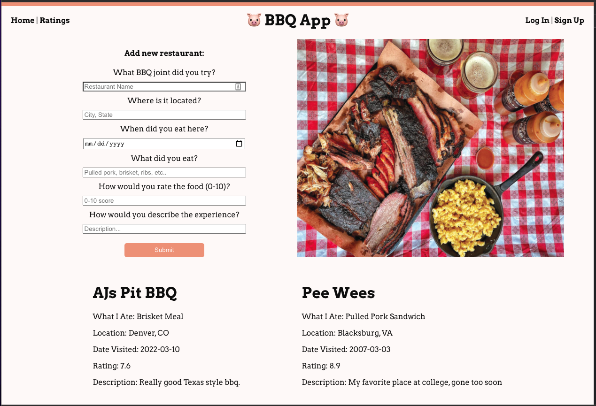

## Project Name & Pitch

BBQ Tracker App

An application used to keep track of all the bbq restaurants you have tried around the country and to give them ratings.  Built with React, Redux, JavaScript, and CSS.

## Project Status
Work in Progress

This project is currently in development. Users can see which restaurants they have visited, what they ate and how they rated them. Future goals are to add in a backend database for data persistance, a detailed view for each restaurant, an interactive map of the country that shows where they have eaten, and much more. 

## Installation and Setup Instructions

Clone down this repository. You will need `node` and `npm` installed globally on your machine.  

Installation:

`npm install`  

To Run Test Suite:  

`npm test`  

To Start Server:

`npm start`  

To Visit App:

`localhost:3000` 

## Project Screen Shot(s) 

 

<!-- ## Reflection

  - What was the context for this project? (ie: was this a side project?
  - What did you set out to build?
  - Why was this project challenging and therefore a really good learning experience?
  - What were some unexpected obstacles?
  - What tools did you use to implement this project?
      - This might seem obvious because you are IN this codebase, but to all other humans now is the time to talk about why you chose webpack instead of create react app, or D3, or vanilla JS instead of a framework etc. Brag about your choices and justify them here.   -->
